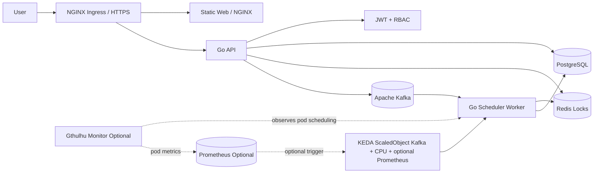

<p align="center">
  <strong>WOMS</strong>
</p>

<p align="center">
  Wafer Order Management And Scheduling System
</p>

<p align="center">
  <a href="README.md">English</a> |
  <a href="README.zh-TW.md">繁體中文</a>
</p>

<p align="center">
  
  
  
  
</p>

---

WOMS is a wafer order management and scheduling system built in its final deployment shape. Sales users create and track orders, scheduler engineers manage production-line schedules and daily production confirmations, and Kafka, Redis, KEDA, and Kubernetes support async rescheduling and scaling.

In practical terms, WOMS accepts wafer orders, turns scheduling requests into asynchronous jobs, locks each production line while a worker computes allocations, stores the resulting calendar capacity in PostgreSQL, and records operational decisions in audit history. The repository is intentionally deployable as a real service, not only as a local prototype.

## Architecture



### Request And Scaling Flow

1. Users access the static web UI through NGINX Ingress or a forwarded local port.
2. The web UI calls the Go API. The API validates JWT/RBAC, reads and writes PostgreSQL, uses Redis for scheduling locks, and publishes schedule jobs to Kafka.
3. Scheduler workers consume `woms.schedule.jobs` as the `woms-scheduler-workers` consumer group, compute deterministic allocations, update PostgreSQL, and write audit records.
4. KEDA scales the worker deployment from the existing WOMS `ScaledObject`. Kafka lag is the primary trigger, CPU utilization is the secondary trigger, and Gthulhu can optionally add one Prometheus trigger for pod scheduling pressure.
5. The WOMS chart can optionally deploy the vendored `gthulhu` subchart in monitor-only mode. Gthulhu observes worker pods, the bundled or Alan Prometheus scrape target reads `/metrics` from `woms-gthulhu-scheduler-sidecar:9090`, and WOMS reads that Prometheus query through KEDA.

### Deployable Units

- `web`: vanilla HTML/CSS/JS frontend served by NGINX.
- `api`: Go REST API for JWT, RBAC, orders, schedule preview, schedule jobs, production confirmation, and audit logs.
- `scheduler-worker`: Go worker, prepared for Kafka consumer scheduling jobs.
- `deploy/helm/woms`: Kubernetes Helm chart for API, worker, web, Ingress, KEDA, Prometheus/Grafana, and the optional `gthulhu` subchart.
- Optional Gthulhu integration: `gthulhu.enabled=false` by default. Use `deploy/helm/woms/values-gthulhu-monitor.yaml` to enable monitor-only Gthulhu, the worker `PodSchedulingMetrics` selector, Alan-compatible Prometheus/Grafana wiring, and the third KEDA Prometheus trigger.

## Prerequisites

Install these tools first:

- Git
- Go 1.22+
- Docker or Docker Desktop
- Docker Compose
- kubectl
- Helm 3
- A Kubernetes cluster, such as Docker Desktop Kubernetes, kind, minikube, or cloud K8s
- NGINX Ingress Controller
- KEDA
- metrics-server, required for CPU autoscaling verification
- Optional for Gthulhu scheduling-pressure autoscaling: a Gthulhu monitor image built from `/home/ubuntu/Gthulhu` and Prometheus/Grafana, either bundled by this chart or supplied by Alan/kube-prometheus-stack

Check your tools:

```bash
go version
docker --version
docker compose version
kubectl version --client=true
helm version
```

## Project Settings

Copy the sample environment file:

```bash
cp .env.example .env
```

Important settings:

- `JWT_SECRET`: JWT signing secret. Replace it in production.
- `AUTH_MODE`: auth verifier mode. `local` uses WOMS JWT login; `edge` accepts the same signed bearer token shape for future gateway-issued tokens and still ignores plain `X-User-*` headers.
- `AUTH_SESSION_STORE`: optional token session backend. Leave empty for stateless JWT; set `redis` only when Redis-backed token revocation is explicitly needed.
- `CORS_ALLOWED_ORIGIN`: allowed API origin. Local defaults to `*`; demos can pin this to the web origin.
- `API_STORE`: API store backend. Helm and Docker default to `postgres`; tests can use memory.
- `DEMO_SEED_DATA`: defaults to `true`; set to `false` to start the API without demo orders.
- `DATABASE_URL`: PostgreSQL connection string.
- `REDIS_ADDR`: Redis address.
- `KAFKA_BROKERS`: Kafka broker list.
- `KAFKA_SCHEDULE_TOPIC`: schedule job topic.
- `KAFKA_PUBLISH_ENABLED`: controls whether the API publishes schedule jobs to Kafka. Defaults to `true`.
- `API_DEPENDENCY_RETRY_TIMEOUT_MS` / `API_DEPENDENCY_RETRY_INTERVAL_MS`: API startup retry window and interval for PostgreSQL/Kafka readiness checks.
- `WORKER_MIN_JOB_DURATION_MS`: demo minimum worker time per job. Production deployments can set it to `0`.
- `WORKER_MAX_RETRIES`: maximum worker retries for transient DB/Kafka errors.
- `WORKER_LOCK_TTL_MS` / `WORKER_LOCK_RENEW_INTERVAL_MS` / `WORKER_LOCK_TIMEOUT_MS`: Redis per-production-line scheduling lock TTL, renewal interval, and acquire timeout.
- `WORKER_BACKFILL_INTERVAL_MS`: how often workers scan queued database jobs for retry/backfill. It must stay above zero when PostgreSQL/Redis lock mode is enabled.
- `WORKER_DEPENDENCY_RETRY_TIMEOUT_MS` / `WORKER_DEPENDENCY_RETRY_INTERVAL_MS`: scheduler-worker startup retry window and interval for PostgreSQL/Kafka readiness checks.
- `DOCKERHUB_NAMESPACE`: Docker Hub namespace.
- `WOMS_IMAGE_TAG`: Docker image tag used by Docker Compose. Defaults to `latest` so Compose builds and local runs stay aligned with the Docker Hub `latest` tag.
- `API_UPSTREAM`: web NGINX upstream for API proxying. Docker Compose sets this to `api:8080`.
- `GRAFANA_UPSTREAM`: web NGINX upstream for Grafana proxying. Docker Compose sets this to `grafana:3000`; Helm sets it to the in-cluster Grafana service.
- `GRAFANA_ADMIN_USER` / `GRAFANA_ADMIN_PASSWORD`: local Docker Compose Grafana credentials. Grafana anonymous access is disabled, so users must sign in before viewing monitoring dashboards.

GitHub Actions Docker Hub settings:

- Repository secret `DOCKERHUB_TOKEN`: Docker Hub Personal Access Token with Read & Write permission.
- Repository variable `DOCKERHUB_USERNAME`: Docker Hub username.
- Repository variable `DOCKERHUB_NAMESPACE`: Docker Hub username or organization namespace.
- Use repository-level Actions settings. Environment-level settings are not required because workflows do not declare `environment:`.

Demo accounts:

- Admin: `admin` / `demo`
- Sales: `sales` / `demo`
- Line A scheduler: `scheduler-a` / `demo`
- Line B scheduler: `scheduler-b` / `demo`
- Line C scheduler: `scheduler-c` / `demo`
- Line D scheduler: `scheduler-d` / `demo`

## Local Development

Run tests:

```bash
go test ./...
```

Run the API:

```bash
JWT_SECRET=local-dev-secret go run ./cmd/api
```

Run with Docker Compose:

```bash
docker compose up --build
```

Docker Compose starts infrastructure with health gates: PostgreSQL must pass `pg_isready`, Redis must answer `PING`, Kafka must answer a broker query, the API must return `/readyz`, and the web container starts only after the API is healthy.

Default services:

- API: `http://localhost:8080`
- Web: `http://localhost:8081`
- Grafana via Web proxy: `http://localhost:8081/grafana`
- Grafana direct debug port: `http://localhost:3000`
- PostgreSQL: `localhost:5432`
- Redis: `localhost:6379`
- Kafka: `localhost:9092`

Grafana security:

- Anonymous Grafana dashboard viewing is disabled.
- Set `GRAFANA_ADMIN_PASSWORD` before running Docker Compose, or copy `.env.example` to `.env` and replace the sample local password.
- Open `http://localhost:8081/grafana/` and sign in with `GRAFANA_ADMIN_USER` / `GRAFANA_ADMIN_PASSWORD` before viewing monitoring dashboards.
- Existing `grafana-storage` volumes keep their original Grafana admin password; reset the password or recreate the local volume if a previous run initialized Grafana with different credentials.

Frontend behavior:

- Users land on a dedicated login page until a valid session exists; internal pages are hidden before login.
- Login is stored in browser `localStorage`, so refresh keeps the current session until the JWT expires or is rejected.
- Admin users can create accounts, assign roles and scheduler production lines, reset temporary passwords, and delete or disable accounts from the Admin panel. Non-admin users receive `403`.
- Production line settings are loaded from `GET /api/lines`; each line includes a required IANA timezone, defaulting to `Asia/Taipei`, while Line D is configured as `Europe/London`. The active production line selector defaults to the lexicographically lowest line for sales/admin users and locks to the assigned line for scheduler users.
- Exact filters support customer and priority. Customer filtering opens as a compact menu, and its options are scoped by the active status and priority filters; order status is controlled by the left status panel.
- Status counts are scoped to the active production line.
- Calendar pages show persisted schedule capacity across the full six-week visible grid, including adjacent-month dates, with the remaining wafer capacity as the primary waterline value. Preview allocations stay on the preview confirmation page and do not change the main calendar.
- Sales users can add customer orders to pending scheduling; customer order due dates must be tomorrow or later in the selected production line's timezone, and invalid due dates show `無法被接受的交期`. Draft feasibility is checked against existing scheduled allocations plus the current pending backlog for that line; the preview dialog shows those pending allocations and waterline usage, and it flags pending orders that the new draft would push past their due date. The main monthly calendar remains unchanged. Scheduler engineers' formal scheduling flow still considers only the selected pending orders.
- Sales users can expand their own pending order cards to proactively edit due date or quantity, resubmit the order, or delete the order before a scheduler rejection is required. The expanded pending-order editor reuses the rejected-order correction flow and labels the context as `修改：業務修改`; rejected-order resubmission remains available from the Sales follow-up area. Order notes are write-on-create only and cannot be rewritten during either pending or rejected resubmission. Scheduler users do not see the sales pending-order editor and keep the original pending-card drag/schedule behavior.
- Scheduler users can preview selected pending orders first, or drag pending orders onto any visible future calendar day. New allocations are not allowed on the selected line's current local date or earlier; if the requested start date is that local date or in the past, scheduling starts from the next local day. Drag scheduling treats a valid dropped calendar day as the requested schedule date, so dropping a future-due order on May 13 previews and persists the allocation on May 13 when capacity is available. When conflicts exist, the preview page can select one or more conflicted orders plus movable low-priority scheduled orders, then generate a conflict-free earliest-completion solution for scheduler review. Accepting that preview replaces the movable orders' open allocations and can show late completion dates when capacity cannot meet all due dates. Manual intervention still requires a reason and explicit conflict acknowledgements before the job is accepted. Direct schedule-job creation without `previewId` is rejected.
- Scheduler workflow history is loaded from backend audit data through `GET /api/schedules/history` and shows schedule jobs, manual force, rejected orders, and production events for the scheduler's assigned line.
- Scheduled orders can be moved into production from the order list or by clicking the order on the calendar. Starting production locks all allocations for that order. In-progress orders are confirmed against a specific calendar allocation date; partial completion keeps the produced quantity on that date as completed calendar capacity and returns the same order ID to pending scheduling with the remaining quantity.
- Popup dialogs are used for warnings, permission failures, and operation results.
- `scheduler-a` demo order `ORD-2` now has a persisted demo allocation, so it appears on the monthly calendar.
- The conflict demo button creates several same-day orders so the preview can show a conflict report.

Persistence note:

- Docker Compose PostgreSQL uses the `postgres-data` named volume, so local database data survives container restarts.
- Docker Compose runs the API against PostgreSQL by default. Startup migrations are idempotent and upgrade existing local volumes, including older role constraints and `schedule_allocations` tables that were created before allocation status tracking existed.
- The Helm chart currently consumes `DATABASE_URL`; it does not yet deploy a PostgreSQL StatefulSet/PVC.

## Docker Build

```bash
docker build -f Dockerfile.api -t woms-api:local .
docker build -f Dockerfile.worker -t woms-scheduler-worker:local .
docker build -f Dockerfile.web -t woms-web:local .
```

## Kubernetes Deployment

Make sure the cluster has KEDA and metrics-server installed first. NGINX Ingress is required only when `ingress.enabled=true`.

A clean VM deployment should have two layers:

1. Platform setup: Kubernetes, metrics-server, and KEDA. For the optional Gthulhu trigger, also install Gthulhu and Prometheus first.
2. WOMS deployment: Helm installs the API, web, scheduler worker, Services, optional Ingress, KEDA ScaledObject, and the PostgreSQL, Redis, and Kafka chart dependencies.

Users should not manually patch the web deployment, create Kafka topics, or tune topic partitions. Those operational details must be handled by the image, Helm chart, or platform bootstrap.

Example single-VM platform setup with MicroK8s:

```bash
sudo snap install microk8s --classic --channel=1.35/stable
sudo usermod -aG microk8s "$USER"
newgrp microk8s
microk8s status --wait-ready
microk8s enable dns hostpath-storage metrics-server
microk8s enable community
microk8s enable keda
microk8s kubectl get node
microk8s kubectl get pods -A
```

Do not continue until the platform pods are healthy. `microk8s kubectl get pods -A` should show the `kube-system` and `keda` pods as `Running`, and namespace events should not contain `MissingClusterDNS`. If `MissingClusterDNS` appears, rerun `microk8s enable dns` in a shell that can complete its sudo-backed kubelet update, then confirm kubelet has a cluster DNS value that matches the `kube-dns` Service `CLUSTER-IP` and `--cluster-domain=cluster.local`:

```bash
microk8s kubectl -n kube-system get pod -l k8s-app=kube-dns
microk8s kubectl -n kube-system get svc kube-dns -o wide
grep -E 'cluster-dns|cluster-domain' /var/snap/microk8s/current/args/kubelet
```

The verified MicroK8s VM used `--cluster-dns=10.152.183.10`, but other clusters may use a different CoreDNS Service IP. Do not copy that value blindly. For each VM, prove that:

- `kube-dns` / CoreDNS pods are `Running`.
- kubelet `--cluster-dns` equals the `kube-dns` Service `CLUSTER-IP`.
- kubelet has `--cluster-domain=cluster.local`.

After WOMS pods exist, also confirm an application pod received that resolver:

```bash
microk8s kubectl exec -n woms deploy/woms-woms-web -- cat /etc/resolv.conf
```

The pod `nameserver` should match the `kube-dns` Service `CLUSTER-IP`, and the search path should include `woms.svc.cluster.local`, `svc.cluster.local`, and `cluster.local`.

If you use MicroK8s instead of standalone `kubectl` and `helm`, either alias the commands for the current shell or replace the commands below with `microk8s kubectl` and `microk8s helm3`.

Render Helm:

```bash
helm template woms ./deploy/helm/woms --dependency-update
```

Deploy:

```bash
helm upgrade --install woms ./deploy/helm/woms --dependency-update \
  --namespace woms --create-namespace
```

Verify the deployed resources before treating the install as complete:

```bash
kubectl get pod,deploy,statefulset,job,pvc,scaledobject,hpa,pdb -n woms
KUBECTL=microk8s.kubectl HELM=microk8s.helm3 NAMESPACE=woms ./scripts/verify-k8s.sh
```

The chart generates or reuses a JWT signing secret when `api.jwtSecret` is unset. Retrieve it with:

```bash
kubectl get secret woms-woms-api -n woms -o jsonpath='{.data.JWT_SECRET}' | base64 -d
```

The chart now deploys bundled PostgreSQL, Redis, and Kafka dependencies by default for local or VM demos, including their stateful workloads and storage. Production deployments should instead use a custom values file with explicit external service endpoints, credentials, `api.jwtSecret`, and, for forked image builds, `imageRegistry`.

API and scheduler-worker containers use bounded startup retry/backoff for PostgreSQL and Kafka readiness. Helm defaults retry for up to 120 seconds with a 2-second interval through `api.env.dependencyRetryTimeoutMs`, `api.env.dependencyRetryIntervalMs`, `worker.env.dependencyRetryTimeoutMs`, and `worker.env.dependencyRetryIntervalMs`.

The chart pins the Bitnami dependency image tags used by the dependency chart versions. Docker Hub no longer serves those retained tags from `bitnami/*`, so the default values override PostgreSQL, Redis, Kafka, and the Kafka topic hook to `bitnamilegacy/*`.

For the single-node MicroK8s demo, the chart also sets Kafka internal topic replication values to `1`, including `offsets.topic.replication.factor`. Without that, `__consumer_offsets` defaults to replication factor `3`, the scheduler worker cannot create `woms-scheduler-workers`, and KEDA cannot read the Kafka lag metric.

If a previous install exists, Bitnami dependencies can require existing generated passwords during `helm upgrade`. For a clean VM demo, remove the old release and PVCs intentionally before reinstalling. For a real upgrade, follow the password hints printed by Helm and pass the existing secrets.

If the Kafka topic hook does not complete, inspect it with:

```bash
kubectl get job,pod -n woms -l app.kubernetes.io/component=kafka-topic
kubectl logs job/woms-woms-kafka-topic -n woms
```

Kafka topics are broker resources, not Kubernetes resources. Do not use `kubectl get` to look for `woms.schedule.jobs`; verify it through Kafka instead:

```bash
kubectl exec -n woms kafka-controller-0 -- \
  kafka-topics.sh --bootstrap-server kafka.woms.svc.cluster.local:9092 \
  --describe --topic woms.schedule.jobs
```

For a local or VM demo, expose the web UI with port-forward:

```bash
kubectl port-forward svc/woms-woms-web 8081:8080 -n woms
```

Open `http://127.0.0.1:8081` and log in with `admin` / `demo`.

When `ingress.enabled=true` and the host resolves to the NGINX Ingress controller, open Grafana through the same WOMS browser entry point:

```text
http(s)://<ingress.host>/grafana
```

No Grafana port-forward is required for the ingress path. The public ingress sends `/grafana` to the web service, and the web NGINX container proxies it to the internal Grafana ClusterIP service. The chart derives `GF_SERVER_ROOT_URL` from `ingress.host`, `ingress.tls.enabled`, and `monitoring.grafana.externalPath`; production deployments can override it with `monitoring.grafana.env.rootUrl`.

In Helm/Kubernetes, the web container proxies `/api/` to `API_UPSTREAM`, which the chart sets to `woms-woms-api:8080`, and proxies `/grafana/` to `GRAFANA_UPSTREAM`, which the chart sets to `woms-woms-grafana:3000`. The Kubernetes NGINX template renders those upstreams directly and relies on the Pod resolver from Kubernetes; it must not use Docker-only DNS such as `127.0.0.11` in Kubernetes. Docker Compose mounts `web/nginx.compose.conf.template` instead, so local Compose runs can use Docker's embedded resolver and re-resolve the `api` and `grafana` services after containers are recreated.

Grafana anonymous access is disabled in Helm. The chart creates a `woms-woms-grafana-admin` Secret with a generated password when `monitoring.grafana.admin.existingSecret` is empty. Production deployments should create their own Secret and set `monitoring.grafana.admin.existingSecret`, `monitoring.grafana.admin.userKey`, and `monitoring.grafana.admin.passwordKey`. Users must sign in to Grafana before they can observe monitoring dashboards. For the generated default Secret, retrieve the password with `kubectl get secret woms-woms-grafana-admin -n woms -o jsonpath='{.data.admin-password}' | base64 -d`.

If the browser runs on a Windows host and WOMS runs on VM `192.168.56.101`, create an SSH tunnel from Windows first:

```powershell
ssh -L 8081:127.0.0.1:8081 ubuntu@192.168.56.101
```

### Scheduler Worker HPA Demo

The HPA scenario for WOMS is the scheduler-worker backlog. During end-of-day planning or rush-order recovery, the API publishes many scheduling jobs to Kafka topic `woms.schedule.jobs`. The scheduler workers share consumer group `woms-scheduler-workers`; when lag exceeds `keda.kafka.lagThreshold`, KEDA creates and drives the HPA named `woms-woms-worker-hpa` for deployment `woms-woms-worker`. CPU utilization is kept as a secondary trigger for compute-heavy scheduling bursts.

Log in to the web UI as admin, open the "multi-line scheduling peak" panel, and click the peak creation button. The API clears old `L001-L200` data, creates 200 demo lines, 1,000 pending orders, and 400 scheduling jobs, then publishes them to Kafka topic `woms.schedule.jobs`. The demo creates multiple jobs per line so Redis line locks are exercised while workers consume the backlog with consumer group `woms-scheduler-workers`; the chart creates the topic automatically with a partition count no smaller than `keda.maxReplicaCount`, so HPA-created worker pods can consume in parallel.

Watch KEDA create the HPA and scale the worker:

```bash
kubectl get scaledobject,hpa,deploy,pod -n woms
kubectl get hpa,deploy,pod -n woms -w
kubectl describe hpa woms-woms-worker-hpa -n woms
kubectl logs deploy/woms-woms-worker -n woms -f
NAMESPACE=woms ./scripts/verify-k8s.sh
```

`verify-k8s.sh` matches the default no-Ingress chart render. For an Ingress deployment, install with `--set ingress.enabled=true` and run `INGRESS_ENABLED=true NAMESPACE=woms ./scripts/verify-k8s.sh`.

HPA does not create pods named `hpa-*`. It is an autoscaling resource that changes `Deployment/woms-woms-worker` replicas. A successful demo shows multiple `woms-woms-worker-*` pods, and `kubectl describe hpa woms-woms-worker-hpa -n woms` shows `SuccessfulRescale` events with the external metric above target.

The chart also includes an optional Gthulhu monitor-only integration. `values.yaml` keeps `gthulhu.enabled=false` and `keda.gthulhu.enabled=false`; `deploy/helm/woms/values-gthulhu-monitor.yaml` enables the vendored `gthulhu` subchart, sets `scheduler.config.mode=none`, exposes `/metrics` on `woms-gthulhu-scheduler-sidecar:9090`, deploys a worker `PodSchedulingMetrics` selector, and adds one Prometheus trigger to the existing worker `ScaledObject`. The PoC overlay sets `scheduler.monitor.monitorAll=true` and uses a suffixed Gthulhu scheduler ConfigMap name so config changes are remounted cleanly. Kafka, CPU, and Gthulhu triggers have independent switches at `keda.kafka.enabled`, `keda.cpu.enabled`, and `keda.gthulhu.enabled`.

Build Gthulhu verification images from the source repo and pass the tag at install time:

When upgrading a VM that has already deployed an older Gthulhu integration, clear the old immutable scheduler ConfigMap before running Helm:

```bash
kubectl delete configmap woms-gthulhu-scheduler-config -n woms --ignore-not-found
```

```bash
REGISTRY=docker.io/d11nn PUSH=true ./scripts/build-push-gthulhu-images.sh
helm upgrade --install woms ./deploy/helm/woms \
  --namespace woms --create-namespace \
  -f ./deploy/helm/woms/values-gthulhu-monitor.yaml \
  --set gthulhu.scheduler.image.tag=woms-integration-<gthulhu-short-sha> \
  --set gthulhu.scheduler.sidecar.image.tag=woms-integration-<gthulhu-short-sha> \
  --set gthulhu.manager.image.tag=woms-integration-<gthulhu-short-sha>
```

If Docker Hub credentials are unavailable, use the MicroK8s registry instead:

```bash
REGISTRY=localhost:32000 PUSH=true ./scripts/build-push-gthulhu-images.sh
helm upgrade --install woms ./deploy/helm/woms \
  --namespace woms --create-namespace \
  -f ./deploy/helm/woms/values-gthulhu-monitor.yaml \
  --set gthulhu.scheduler.image.repository=localhost:32000/gthulhu-scx \
  --set gthulhu.scheduler.image.tag=woms-integration-<gthulhu-short-sha> \
  --set gthulhu.scheduler.sidecar.image.repository=localhost:32000/gthulhu-api \
  --set gthulhu.scheduler.sidecar.image.tag=woms-integration-<gthulhu-short-sha> \
  --set gthulhu.manager.image.repository=localhost:32000/gthulhu-api \
  --set gthulhu.manager.image.tag=woms-integration-<gthulhu-short-sha>
```

Alan integration contract: scrape path `/metrics`, service `woms-gthulhu-scheduler-sidecar`, port `9090`. The dashboard includes `Worker Involuntary Context Switch Rate`, `Worker Run Queue Wait Time Rate`, and `Tracked Worker Process Count` panels. The bundled Prometheus target adds its own `namespace` label, so Gthulhu's original pod namespace is queried as `exported_namespace="woms"`.

Verify each scaler path independently:

```bash
./scripts/verify-gthulhu-monitoring.sh
HPA_SCENARIO=cpu ./scripts/verify-hpa-behavior.sh
HPA_SCENARIO=kafka ./scripts/verify-hpa-behavior.sh
HPA_SCENARIO=gthulhu ./scripts/verify-hpa-behavior.sh
```

`verify-hpa-behavior.sh` defaults `GTHULHU_IMAGE_TAG` to `woms-integration-f71f78a`; set `GTHULHU_IMAGE_TAG=woms-integration-<gthulhu-short-sha>` when validating a different image tag.

For GKE Standard, keep Gthulhu on Linux node pools that allow the required eBPF/hostPID/privileged/hostPath settings, keep monitor-only mode unless scheduler handoff is explicitly approved, and use release image tags such as `vX.Y.Z` instead of verification tags.

Before changing the Gthulhu branch or image used with WOMS, follow the [Gthulhu and WOMS deployment alignment guide](docs/gthulhu-woms-deployment.en.md). The validated WOMS PoC baseline is Gthulhu `d11nn/feat/woms-poc`; any newer upstream image must be rebuilt and revalidated before it can be treated as equivalent.

### API And Web High Availability Demo

The non-HPA high-availability scenario is voluntary disruption protection for the request path. API and web run with two replicas by default, and the Helm chart creates `PodDisruptionBudget` resources `woms-woms-api` and `woms-woms-web` with `minAvailable: 1`. During node drain, cluster upgrades, or other voluntary evictions, Kubernetes must keep at least one API pod and one web pod available.

Verify the resources after deployment:

```bash
kubectl get deploy,pdb -n woms
kubectl describe pdb woms-woms-api -n woms
kubectl describe pdb woms-woms-web -n woms
```

On a multi-node local cluster, drain one worker node and keep watching API/web availability:

```bash
kubectl drain <node-name> --ignore-daemonsets --delete-emptydir-data
kubectl get deploy,pod,pdb -n woms -w
curl -i http://<ingress-or-forwarded-web-url>/
kubectl uncordon <node-name>
```

## CI/CD

GitHub Actions runs:

- `go test ./...`
- `npm run test:web`
- `gofmt` check
- API, worker, and web Docker builds
- Helm rendering
- Scheduler worker HPA/KEDA render verification with `./scripts/verify-hpa-render.sh`
- Docker Hub push and tagging on `main`, `release/**`, or manual dispatch
- Automatic Helm image tag update on `main`
- Automatic Git tag creation on every successful `main` publish, using `v0.1.<run-number>` by default

Required GitHub repository settings:

- Secret: `DOCKERHUB_TOKEN`
- Variable: `DOCKERHUB_USERNAME`
- Variable: `DOCKERHUB_NAMESPACE`

Image tags include the release tag and `latest` for the protected main/release publish flow. The `docker-publish` workflow commits the release tag back into `deploy/helm/woms/values.yaml` with `[skip ci]`, then creates the matching Git tag.

Branch workflow:

- `main` must exist and be protected.
- Development happens on `feat/xxxx-xxxx` branches.
- Open a PR from `feat/...` to `main` to trigger the CI bot.
- `docker-publish` runs only after code reaches `main`, `release/**`, or when manually triggered.
- Do not enable Docker Hub publishing on feature branch pushes.

## Post-Implementation Verification

Full verification steps:

- [Verification Guide zh-TW](docs/verification.zh-TW.md)
- [Verification Guide en](docs/verification.en.md)

Helper scripts:

```bash
BASE_URL=http://localhost:8080 ./scripts/smoke-api.sh
NAMESPACE=woms ./scripts/verify-k8s.sh
```

Minimum completion criteria:

- API without token returns `401`.
- Sales calling scheduler APIs returns `403`.
- Scheduler A cannot read or mutate Scheduler B line data.
- `helm template` renders KEDA `ScaledObject` and PDBs by default; it renders Ingress when `ingress.enabled=true`.
- Worker replicas scale up when Kafka lag increases and scale down after lag drains.
- README, tests, commit, and push must be completed with every feature.
