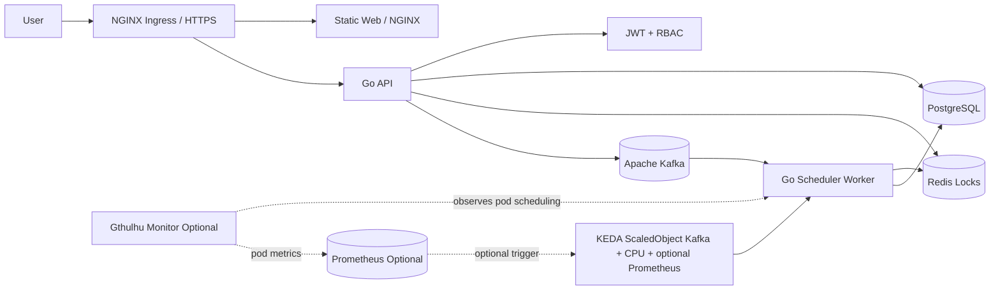

<p align="center">
  <strong>WOMS</strong>
</p>

<p align="center">
  晶圓訂單管理與排程系統
</p>

<p align="center">
  <a href="README.md">English</a> |
  <a href="README.zh-TW.md">繁體中文</a>
</p>

<p align="center">
  
  
  
  
</p>

---

WOMS 是以最終部署型態建置的晶圓訂單管理與排程系統。業務使用者建立與追蹤訂單，排程工程師管理產線排程與每日生產回報，Kafka、Redis、KEDA 與 Kubernetes 支援非同步重排與擴縮。

實務上，WOMS 會接收晶圓訂單，把排程請求轉成非同步任務，在 worker 計算 allocation 時鎖定各 production line，把月曆產能結果保存到 PostgreSQL，並把營運決策寫入 audit history。這個 repository 的目標是能以真實服務型態部署，不只是本機 prototype。

## 架構



### Request 與 Scaling Flow

1. 使用者透過 NGINX Ingress 或本機 forwarded port 存取 static web UI。
2. Web UI 呼叫 Go API。API 會驗證 JWT/RBAC，讀寫 PostgreSQL，使用 Redis 做排程鎖，並把排程任務 publish 到 Kafka。
3. Scheduler workers 以 `woms-scheduler-workers` consumer group 消費 `woms.schedule.jobs`，計算 deterministic allocations，更新 PostgreSQL，並寫入 audit records。
4. KEDA 透過 WOMS 既有 `ScaledObject` 擴縮 worker deployment。Kafka lag 是主要 trigger，CPU utilization 是次要 trigger，Gthulhu 可選擇性新增一個 Prometheus trigger 來反映 pod scheduling pressure。
5. WOMS chart 可選擇性部署 vendored `gthulhu` subchart 的 monitor-only 模式。Gthulhu 觀察 worker pods，內建或 Alan Prometheus scrape target 從 `woms-gthulhu-scheduler-sidecar:9090` 讀 `/metrics`，WOMS 再透過 KEDA 讀 Prometheus query。

### 可部署單元

- `web`：由 NGINX 提供的原生 HTML/CSS/JS 前端。
- `api`：Go REST API，負責 JWT、RBAC、訂單、試排、排程任務、生產回報與稽核紀錄。
- `scheduler-worker`：Go worker，作為 Kafka 排程任務 consumer 的部署單元。
- `deploy/helm/woms`：部署 API、worker、web、Ingress、KEDA、Prometheus/Grafana 與 optional `gthulhu` subchart 的 Kubernetes Helm chart。
- 可選 Gthulhu 整合：`gthulhu.enabled=false` 是預設值。使用 `deploy/helm/woms/values-gthulhu-monitor.yaml` 會啟用 monitor-only Gthulhu、worker `PodSchedulingMetrics` selector、Alan-compatible Prometheus/Grafana wiring，以及第三個 KEDA Prometheus trigger。

## 前置需求

請先安裝：

- Git
- Go 1.22+
- Docker 或 Docker Desktop
- Docker Compose
- kubectl
- Helm 3
- Kubernetes 叢集，例如 Docker Desktop Kubernetes、kind、minikube 或雲端 K8s
- NGINX Ingress Controller
- KEDA
- metrics-server，CPU autoscaling 驗證會用到
- Gthulhu scheduling-pressure autoscaling 選配：由 `/home/ubuntu/Gthulhu` build 的 Gthulhu monitor image，以及此 chart 內建或 Alan/kube-prometheus-stack 提供的 Prometheus/Grafana

檢查工具版本：

```bash
go version
docker --version
docker compose version
kubectl version --client=true
helm version
```

## 專案設定

複製範例環境檔：

```bash
cp .env.example .env
```

重要設定：

- `JWT_SECRET`：JWT 簽章密鑰，正式環境必須更換。
- `AUTH_MODE`：auth verifier 模式。`local` 使用 WOMS JWT login；`edge` 保留 future gateway-issued signed bearer token stub，仍不信任普通 `X-User-*` headers。
- `AUTH_SESSION_STORE`：可選 token session backend。預設留空使用 stateless JWT；只有明確需要 Redis-backed token revocation 時才設為 `redis`。
- `CORS_ALLOWED_ORIGIN`：API 允許的 origin。Local 預設 `*`；展示環境可固定為 web origin。
- `API_STORE`：API store backend；Helm/Docker 預設 `postgres`，測試可使用 memory。
- `DEMO_SEED_DATA`：預設 `true`；設為 `false` 可不載入 demo orders。
- `DATABASE_URL`：PostgreSQL 連線字串。
- `REDIS_ADDR`：Redis 位址。
- `KAFKA_BROKERS`：Kafka broker 清單。
- `KAFKA_SCHEDULE_TOPIC`：排程任務 topic。
- `KAFKA_PUBLISH_ENABLED`：是否由 API publish 排程任務到 Kafka，預設 `true`。
- `API_DEPENDENCY_RETRY_TIMEOUT_MS` / `API_DEPENDENCY_RETRY_INTERVAL_MS`：API 啟動時等待 PostgreSQL/Kafka readiness 的 retry 視窗與間隔。
- `WORKER_MIN_JOB_DURATION_MS`：worker 每個 job 的 demo 最小處理時間，正式環境可設為 `0`。
- `WORKER_MAX_RETRIES`：worker 遇到暫時性 DB/Kafka 錯誤時的最大重試次數。
- `WORKER_LOCK_TTL_MS` / `WORKER_LOCK_RENEW_INTERVAL_MS` / `WORKER_LOCK_TIMEOUT_MS`：Redis per-production-line scheduling lock 的 TTL、renewal interval 與 acquire timeout。
- `WORKER_BACKFILL_INTERVAL_MS`：worker 掃描 queued database jobs 進行 retry/backfill 的間隔。PostgreSQL/Redis lock 模式必須大於 0。
- `WORKER_DEPENDENCY_RETRY_TIMEOUT_MS` / `WORKER_DEPENDENCY_RETRY_INTERVAL_MS`：scheduler-worker 啟動時等待 PostgreSQL/Kafka readiness 的 retry 視窗與間隔。
- `DOCKERHUB_NAMESPACE`：Docker Hub namespace。
- `WOMS_IMAGE_TAG`：Docker Compose 使用的 image tag，預設 `latest`。
- `API_UPSTREAM`：web NGINX 代理 API 的 upstream；Docker Compose 會設定為 `api:8080`。
- `GRAFANA_UPSTREAM`：web NGINX 代理 Grafana 的 upstream；Docker Compose 會設定為 `grafana:3000`，Helm 會設定為叢集內 Grafana service。

GitHub Actions Docker Hub 設定：

- Repository secret `DOCKERHUB_TOKEN`：具備 Read & Write 權限的 Docker Hub Personal Access Token。
- Repository variable `DOCKERHUB_USERNAME`：Docker Hub 使用者名稱。
- Repository variable `DOCKERHUB_NAMESPACE`：Docker Hub 使用者或組織 namespace。
- 使用 repository-level Actions settings 即可；workflow 沒有宣告 `environment:`，不需要 environment-level 設定。

Demo 帳號：

- Admin：`admin` / `demo`
- Sales：`sales` / `demo`
- A 線 scheduler：`scheduler-a` / `demo`
- B 線 scheduler：`scheduler-b` / `demo`
- C 線 scheduler：`scheduler-c` / `demo`
- D 線 scheduler：`scheduler-d` / `demo`

## 本機開發

執行測試：

```bash
go test ./...
npm run test:web
```

執行 API：

```bash
JWT_SECRET=local-dev-secret go run ./cmd/api
```

使用 Docker Compose：

```bash
docker compose up --build
```

Docker Compose 會透過 health gate 啟動基礎服務：PostgreSQL 必須通過 `pg_isready`，Redis 必須回應 `PING`，Kafka 必須能回應 broker query，API 必須回傳 `/readyz`，Web container 會等 API healthy 後才啟動。

預設服務：

- API：`http://localhost:8080`
- Web：`http://localhost:8081`
- 透過 Web proxy 存取 Grafana：`http://localhost:8081/grafana`
- Grafana 直接除錯連線：`http://localhost:3000`
- PostgreSQL：`localhost:5432`
- Redis：`localhost:6379`
- Kafka：`localhost:9092`

前端行為：

- 未登入時只顯示登入頁；有效 session 存在前不顯示內部頁面。
- Login 會保存在 browser `localStorage`，重新整理後會維持 session，直到 JWT 過期或被拒絕。
- admin 可在 Admin panel 建立帳號、指派角色與 scheduler 產線、重設臨時密碼、刪除或停用帳號；非 admin 會收到 `403`。
- 產線設定由 `GET /api/lines` 載入；每條產線都有必填 IANA timezone，預設為 `Asia/Taipei`，其中 D 線設定為 `Europe/London`。active production line selector 對 sales/admin 預設選字典序最小的產線；scheduler 會鎖定自己的產線。
- 精準篩選支援客戶與優先級。客戶篩選是展開式選單，選項會依目前狀態與優先級篩選縮小；訂單狀態由左側狀態面板控制。
- 狀態數量會依目前產線統計。
- 月曆會顯示完整六週可見範圍內已保存的排程產能，包含相鄰月份日期；水位主要顯示當日剩餘可排片數。試排 allocation 只會出現在試排確認頁，不會混入主月曆。
- sales 可以把客戶訂單加入待排程；客戶訂單交期必須是所選產線 timezone 的明天或更晚日期，無效交期會顯示 `無法被接受的交期`。草稿可行性會對照既有已排程 allocation，並把同產線目前待排程 backlog 納入產能占用；preview dialog 會顯示這些待排程 allocation 與水位占用，也會標註因新草稿訂單而被推遲到交期後的待排程訂單。主月排程行事曆不會被改變。scheduler 的正式排程流程仍只計算被選取的待排程訂單。
- sales 可以展開自己建立的待排程訂單卡片，主動修改交期或數量、重新送出訂單，或在不等待 scheduler 駁回的情況下刪除訂單。展開後的待排程修正區塊會重用被駁回訂單的修正流程，並以 `修改：業務修改` 標示主動修正情境；被駁回訂單仍可在「需處理訂單」區域重新送出。訂單備註只能在建立時寫入，待排程或被駁回訂單重新送出時都不能改寫原始備註。scheduler 不會看到 sales 待排程修正介面，原本的待排程卡片拖曳與排程行為維持不變。
- scheduler 可以先預覽已選取的待排程訂單，也可以把待排程訂單拖到任何可見的未來月曆日期。新 allocation 不允許落在所選產線的 local date 當日或更早日期；若指定開始日是該 local date 或過去日期，排程會從下一個 local date 開始。拖曳排程會把有效的實際放下月曆日期當成指定排程日；例如交期 5/20 的訂單拖到 5/13，產能足夠時會預覽並保存到 5/13。發生衝突時，preview 頁可以直接選取一張或多張衝突訂單，並勾選可移動的低優先級已排程訂單，產生一個無阻擋衝突的最早完成解法供 scheduler 預覽。接受該 preview 後會替可移動訂單更換未鎖定 allocation；若產能無法滿足所有交期，解法會顯示晚於交期的完成日期。人工介入仍必須填寫原因並逐項確認衝突清單後才會接受任務；缺少 `previewId` 的直接排程 API 會被拒絕。
- scheduler workflow history 由後端 audit data 載入，透過 `GET /api/schedules/history` 顯示 scheduler 所屬產線的 schedule jobs、manual force、rejected orders 與 production events。
- 已排程訂單可以從訂單列表或月曆訂單點擊後轉入生產中。開始生產會鎖住該訂單所有 allocation。生產中訂單會依特定月曆 allocation 日期回報；部分完成會把該日期已生產數量保留在月曆作為已完成產能，並讓同一張訂單編號以剩餘數量回到待排程。
- Popup dialogs 用於警告、權限失敗與操作結果。
- `scheduler-a` demo 訂單 `ORD-2` 已有保存的 demo allocation，因此會出現在月曆上。
- 衝突測試按鈕會建立多張同日訂單，讓 preview 顯示 conflict report。

持久化備註：

- Docker Compose PostgreSQL 使用 `postgres-data` named volume，因此本機資料會在 container restart 後保留。
- Docker Compose 預設讓 API 使用 PostgreSQL。啟動時 migration 可重複執行，並會升級既有本機 volume，包含舊版角色 constraint，以及在 allocation status tracking 加入前建立、缺少 `schedule_allocations.status` 欄位的舊表。
- Helm chart 目前會使用 `DATABASE_URL`，但尚未部署 PostgreSQL StatefulSet/PVC。

## Docker Build

```bash
docker build -f Dockerfile.api -t woms-api:local .
docker build -f Dockerfile.worker -t woms-scheduler-worker:local .
docker build -f Dockerfile.web -t woms-web:local .
```

## Kubernetes 部署

請先確認叢集已安裝 KEDA 與 metrics-server。只有啟用 `ingress.enabled=true` 時才需要 NGINX Ingress。

乾淨 VM 的使用者流程應該分成兩層：

1. 平台準備：Kubernetes、metrics-server 與 KEDA。若要啟用 optional Gthulhu trigger，需先安裝 Gthulhu 與 Prometheus。
2. WOMS 部署：使用 Helm 部署 API、web、scheduler-worker、Service、可選的 Ingress、KEDA ScaledObject，以及 PostgreSQL、Redis、Kafka chart dependencies。

使用者不應手動 patch web deployment、手動建立 Kafka topic，或手動調整 topic partitions。這些都必須由 image、Helm chart 或平台 bootstrap 自動處理。

單一 VM 使用 MicroK8s 的平台準備範例：

```bash
sudo snap install microk8s --classic --channel=1.35/stable
sudo usermod -aG microk8s "$USER"
newgrp microk8s
microk8s status --wait-ready
microk8s enable dns hostpath-storage metrics-server
microk8s enable community
microk8s enable keda
microk8s kubectl get node
microk8s kubectl get pods -A
```

平台 pods 健康前不要繼續部署 WOMS。`microk8s kubectl get pods -A` 應顯示 `kube-system` 與 `keda` pods 都是 `Running`，namespace events 不應出現 `MissingClusterDNS`。如果看到 `MissingClusterDNS`，請在能完成 sudo-backed kubelet 更新的 shell 重新執行 `microk8s enable dns`，再確認 kubelet 的 cluster DNS 值與 `kube-dns` Service `CLUSTER-IP` 一致，且有 `--cluster-domain=cluster.local`：

```bash
microk8s kubectl -n kube-system get pod -l k8s-app=kube-dns
microk8s kubectl -n kube-system get svc kube-dns -o wide
grep -E 'cluster-dns|cluster-domain' /var/snap/microk8s/current/args/kubelet
```

本次驗證的 MicroK8s VM 使用 `--cluster-dns=10.152.183.10`，但其他叢集可能會使用不同的 CoreDNS Service IP。不要直接照抄這個值；每台 VM 都要證明：

- `kube-dns` / CoreDNS pods 是 `Running`。
- kubelet `--cluster-dns` 等於 `kube-dns` Service 的 `CLUSTER-IP`。
- kubelet 有 `--cluster-domain=cluster.local`。

WOMS pods 建立後，也要確認 application pod 真的拿到這個 resolver：

```bash
microk8s kubectl exec -n woms deploy/woms-woms-web -- cat /etc/resolv.conf
```

Pod 裡的 `nameserver` 應等於 `kube-dns` Service 的 `CLUSTER-IP`，search path 應包含 `woms.svc.cluster.local`、`svc.cluster.local` 與 `cluster.local`。

若使用 MicroK8s 而不是獨立安裝的 `kubectl` 與 `helm`，可以先在目前 shell 設定 alias，或把下方指令改成 `microk8s kubectl` 與 `microk8s helm3`。

Render Helm：

```bash
helm template woms ./deploy/helm/woms --dependency-update
```

Deploy：

```bash
helm upgrade --install woms ./deploy/helm/woms --dependency-update \
  --namespace woms --create-namespace
```

部署後先驗證資源，再視為安裝完成：

```bash
kubectl get pod,deploy,statefulset,job,pvc,scaledobject,hpa,pdb -n woms
NAMESPACE=woms ./scripts/verify-k8s.sh
```

當 `api.jwtSecret` 未設定時，chart 會自動產生或重用 JWT signing secret。可用下列指令取得：

```bash
kubectl get secret woms-woms-api -n woms -o jsonpath='{.data.JWT_SECRET}' | base64 -d
```

目前 Helm chart 會一併安裝內建 PostgreSQL、Redis 與 Kafka dependencies，供本機、單節點 MicroK8s 或 VM demo 使用，並建立對應的 StatefulSet / PVC。這些預設僅適合示範與開發環境，不建議直接用於正式環境。

正式環境應使用自訂 values file，明確設定外部服務 endpoint、credentials、`api.jwtSecret`；若使用 fork 後自行建置的 images，也應設定 `imageRegistry`。

API 與 scheduler-worker container 會在啟動時對 PostgreSQL 與 Kafka readiness 做 bounded retry/backoff。Helm 預設透過 `api.env.dependencyRetryTimeoutMs`、`api.env.dependencyRetryIntervalMs`、`worker.env.dependencyRetryTimeoutMs`、`worker.env.dependencyRetryIntervalMs` 設定最多等待 120 秒、每 2 秒重試一次。

Chart 會固定 dependency chart 版本使用的 Bitnami image tags。Docker Hub 已不再從 `bitnami/*` 提供這些保留 tags，因此預設 values 會把 PostgreSQL、Redis、Kafka 與 Kafka topic hook 覆寫到 `bitnamilegacy/*`。

單節點 MicroK8s demo 中，chart 也會把 Kafka internal topic replication 設為 `1`，包含 `offsets.topic.replication.factor`。若未設定，`__consumer_offsets` 會沿用 replication factor `3`，scheduler worker 無法建立 `woms-scheduler-workers` consumer group，KEDA 也無法讀取 Kafka lag metric。

如果環境中已有舊 release，Bitnami dependencies 在 `helm upgrade` 時可能要求帶入既有自動產生的 passwords。乾淨 VM demo 應先明確刪除舊 release 與 PVC 後再重新安裝；真正升級時則依 Helm 錯誤訊息提示，把既有 secrets 帶入。

如果 Kafka topic hook 沒有完成，可用下列指令檢查：

```bash
kubectl get job,pod -n woms -l app.kubernetes.io/component=kafka-topic
kubectl logs job/woms-woms-kafka-topic -n woms
```

Kafka topic 是 broker 內部資源，不是 Kubernetes resource。不要用 `kubectl get` 尋找 `woms.schedule.jobs`；請透過 Kafka 驗證：

```bash
kubectl exec -n woms kafka-controller-0 -- \
  kafka-topics.sh --bootstrap-server kafka.woms.svc.cluster.local:9092 \
  --describe --topic woms.schedule.jobs
```

本機或 VM demo 可用 port-forward 開啟前端：

```bash
kubectl port-forward svc/woms-woms-web 8081:8080 -n woms
```

瀏覽器開啟 `http://127.0.0.1:8081`，demo 帳號為 `admin` / `demo`。

當 `ingress.enabled=true` 且 host 解析到 NGINX Ingress controller 時，可從同一個 WOMS browser 入口開啟 Grafana：

```text
http(s)://<ingress.host>/grafana
```

使用 ingress path 時不需要額外對 Grafana port-forward。public ingress 會把 `/grafana` 送到 web service，再由 web NGINX container proxy 到內部 Grafana ClusterIP service。Chart 會依 `ingress.host`、`ingress.tls.enabled` 與 `monitoring.grafana.externalPath` 產生 `GF_SERVER_ROOT_URL`；正式環境若有外部 DNS、TLS terminator 或非預設路徑，可用 `monitoring.grafana.env.rootUrl` 覆寫。

在 Helm/Kubernetes 中，web container 會把 `/api/` 代理到 `API_UPSTREAM`，chart 會設定為 `woms-woms-api:8080`，並把 `/grafana/` 代理到 `GRAFANA_UPSTREAM`，chart 會設定為 `woms-woms-grafana:3000`。Kubernetes NGINX template 會直接 render 這些 upstream，並使用 Kubernetes 寫入 Pod 的 resolver；Kubernetes 部署中不應使用 `127.0.0.11` 這類 Docker-only DNS。Docker Compose 會改掛載 `web/nginx.compose.conf.template`，讓本機 Compose 環境使用 Docker embedded resolver，並在 API 或 Grafana container 重建後重新解析 service。

如果瀏覽器在另一台 Windows 主機，而 WOMS 跑在 VM `192.168.56.101`，先從 Windows 建立 SSH tunnel：

```powershell
ssh -L 8081:127.0.0.1:8081 ubuntu@192.168.56.101
```

### Scheduler Worker HPA Demo

WOMS 的 HPA 情境是 scheduler-worker backlog。月底排程或急單復原時，API 會把大量排程任務送到 Kafka topic `woms.schedule.jobs`。scheduler workers 共用 consumer group `woms-scheduler-workers`；當 lag 超過 `keda.kafka.lagThreshold`，KEDA 會建立並驅動 deployment `woms-woms-worker` 的 HPA `woms-woms-worker-hpa`。CPU utilization 保留為第二 trigger，用來支援排程計算尖峰。

用 admin 登入 web，開啟「多產線排程尖峰」面板並按「建立多產線排程尖峰」。API 會先清除 `L001-L200` 舊資料，再建立 200 條 demo 產線、1,000 張待排程訂單與 400 個排程任務，並 publish 到 Kafka topic `woms.schedule.jobs`。demo 會為每條產線建立多個 jobs，因此可以實際觸發 Redis line lock；worker 會用 consumer group `woms-scheduler-workers` 消化 backlog。chart 會自動建立 topic，partition 數預設不小於 `keda.maxReplicaCount`，讓 HPA 擴出的 worker pods 可以平行消費。

觀察 KEDA 建立 HPA 並擴展 worker：

```bash
kubectl get scaledobject,hpa,deploy,pod -n woms
kubectl get hpa,deploy,pod -n woms -w
kubectl describe hpa woms-woms-worker-hpa -n woms
kubectl logs deploy/woms-woms-worker -n woms -f
NAMESPACE=woms ./scripts/verify-k8s.sh
```

`verify-k8s.sh` 會對應預設不啟用 Ingress 的 chart render。若使用 Ingress 部署，請先用 `--set ingress.enabled=true` 安裝，再執行 `INGRESS_ENABLED=true NAMESPACE=woms ./scripts/verify-k8s.sh`。

HPA 不會建立名為 `hpa-*` 的 pod。HPA 是 autoscaling resource，會調整 `Deployment/woms-woms-worker` 的 replicas；成功時會看到多個 `woms-woms-worker-*` pods。`kubectl describe hpa woms-woms-worker-hpa -n woms` 的 Events 會顯示 `SuccessfulRescale` 與 external metric above target。

Chart 也提供可選的 Gthulhu monitor-only integration。`values.yaml` 維持 `gthulhu.enabled=false` 與 `keda.gthulhu.enabled=false`；`deploy/helm/woms/values-gthulhu-monitor.yaml` 會啟用 vendored `gthulhu` subchart、設定 `scheduler.config.mode=none`、在 `woms-gthulhu-scheduler-sidecar:9090` 暴露 `/metrics`、部署 worker `PodSchedulingMetrics` selector，並把一個 Prometheus trigger 加進既有 worker `ScaledObject`。PoC overlay 會設定 `scheduler.monitor.monitorAll=true`，並使用加 suffix 的 Gthulhu scheduler ConfigMap name，讓 config 變更能乾淨重新掛載。Kafka、CPU、Gthulhu triggers 分別由 `keda.kafka.enabled`、`keda.cpu.enabled`、`keda.gthulhu.enabled` 獨立控制。

從 Gthulhu source repo build 驗證 image，安裝時再帶入 tag：

如果是在已部署過舊版 Gthulhu integration 的 VM 上升級，先清掉舊的 immutable scheduler ConfigMap，再執行 Helm：

```bash
kubectl delete configmap woms-gthulhu-scheduler-config -n woms --ignore-not-found
```

```bash
REGISTRY=docker.io/d11nn PUSH=true ./scripts/build-push-gthulhu-images.sh
helm upgrade --install woms ./deploy/helm/woms \
  --namespace woms --create-namespace \
  -f ./deploy/helm/woms/values-gthulhu-monitor.yaml \
  --set gthulhu.scheduler.image.tag=woms-integration-<gthulhu-short-sha> \
  --set gthulhu.scheduler.sidecar.image.tag=woms-integration-<gthulhu-short-sha> \
  --set gthulhu.manager.image.tag=woms-integration-<gthulhu-short-sha>
```

若 Docker Hub credentials 不可用，改用 MicroK8s local registry：

```bash
REGISTRY=localhost:32000 PUSH=true ./scripts/build-push-gthulhu-images.sh
helm upgrade --install woms ./deploy/helm/woms \
  --namespace woms --create-namespace \
  -f ./deploy/helm/woms/values-gthulhu-monitor.yaml \
  --set gthulhu.scheduler.image.repository=localhost:32000/gthulhu-scx \
  --set gthulhu.scheduler.image.tag=woms-integration-<gthulhu-short-sha> \
  --set gthulhu.scheduler.sidecar.image.repository=localhost:32000/gthulhu-api \
  --set gthulhu.scheduler.sidecar.image.tag=woms-integration-<gthulhu-short-sha> \
  --set gthulhu.manager.image.repository=localhost:32000/gthulhu-api \
  --set gthulhu.manager.image.tag=woms-integration-<gthulhu-short-sha>
```

Alan integration contract：scrape path 是 `/metrics`，service 是 `woms-gthulhu-scheduler-sidecar`，port 是 `9090`。Dashboard 會包含 `Worker Involuntary Context Switch Rate`、`Worker Run Queue Wait Time Rate` 與 `Tracked Worker Process Count` panels。內建 Prometheus target 會加上自己的 `namespace` label，因此 Gthulhu 原始 pod namespace 需要用 `exported_namespace="woms"` 查詢。

三種 scaler path 可分開驗證：

```bash
./scripts/verify-gthulhu-monitoring.sh
HPA_SCENARIO=cpu ./scripts/verify-hpa-behavior.sh
HPA_SCENARIO=kafka ./scripts/verify-hpa-behavior.sh
HPA_SCENARIO=gthulhu ./scripts/verify-hpa-behavior.sh
```

`verify-hpa-behavior.sh` 預設 `GTHULHU_IMAGE_TAG` 為 `woms-integration-f71f78a`；若要驗證其他 image tag，請設定 `GTHULHU_IMAGE_TAG=woms-integration-<gthulhu-short-sha>`。

搬到 GKE Standard 時，Gthulhu 應放在允許 eBPF、hostPID、privileged 與 hostPath 的 Linux node pool；除非明確核准 scheduler handoff，仍保持 monitor-only；正式版本請用 `vX.Y.Z` 這類 release image tag，不要沿用驗證 tag。

變更 WOMS 搭配使用的 Gthulhu branch 或 image 前，請先依照 [Gthulhu 與 WOMS 部署對齊指南](docs/gthulhu-woms-deployment.zh-TW.md) 檢查。已驗證的 WOMS PoC 基準是 Gthulhu `d11nn/feat/woms-poc`；任何較新的 upstream image 都必須重新 build 並驗證後，才能視為等同環境。

### API And Web High Availability Demo

HPA 之外的 high availability 情境是 request path 的 voluntary disruption protection。API 與 web 預設各有兩個 replicas，Helm chart 會建立 `PodDisruptionBudget` `woms-woms-api` 與 `woms-woms-web`，並設定 `minAvailable: 1`。當 node drain、cluster upgrade 或其他 voluntary eviction 發生時，Kubernetes 必須保留至少一個 API pod 與一個 web pod 可服務。

部署後確認資源：

```bash
kubectl get deploy,pdb -n woms
kubectl describe pdb woms-woms-api -n woms
kubectl describe pdb woms-woms-web -n woms
```

在多節點本機 cluster 上，可以 drain 一個 worker node 並持續觀察 API/web 可用性：

```bash
kubectl drain <node-name> --ignore-daemonsets --delete-emptydir-data
kubectl get deploy,pod,pdb -n woms -w
curl -i http://<ingress-or-forwarded-web-url>/
kubectl uncordon <node-name>
```

## CI/CD

GitHub Actions 會執行：

- `go test ./...`
- `npm run test:web`
- `gofmt` check
- API、worker 與 web Docker builds
- Helm rendering
- 使用 `./scripts/verify-hpa-render.sh` 驗證 scheduler worker HPA/KEDA render
- 在 `main`、`release/**` 或 manual dispatch 時推送 Docker Hub image 與 tag
- 在 `main` 自動更新 Helm image tag
- 每次 `main` publish 成功後自動建立 Git tag，預設格式為 `v0.1.<run-number>`

必要 GitHub repository settings：

- Secret：`DOCKERHUB_TOKEN`
- Variable：`DOCKERHUB_USERNAME`
- Variable：`DOCKERHUB_NAMESPACE`

Image tags 會包含 release tag 與 `latest`，用於受保護的 main/release publish flow。`docker-publish` workflow 會把 release tag 寫回 `deploy/helm/woms/values.yaml` 並使用 `[skip ci]` commit，然後建立對應 Git tag。

Branch workflow：

- `main` 必須存在並受保護。
- 開發在 `feat/xxxx-xxxx` branches 上進行。
- 從 `feat/...` 開 PR 到 `main` 以觸發 CI bot。
- `docker-publish` 只會在程式碼進入 `main`、`release/**` 或 manual trigger 後執行。
- 不要讓 feature branch push 觸發 Docker Hub publish。

## 實作後驗證

完整驗證步驟：

- [Verification Guide zh-TW](docs/verification.zh-TW.md)
- [Verification Guide en](docs/verification.en.md)

輔助腳本：

```bash
BASE_URL=http://localhost:8080 ./scripts/smoke-api.sh
NAMESPACE=woms ./scripts/verify-k8s.sh
```

最低完成標準：

- API 未帶 token 會回 `401`。
- sales 呼叫 scheduler API 會回 `403`。
- Scheduler A 不能讀取或修改 Scheduler B 產線資料。
- `helm template` 預設可 render KEDA `ScaledObject` 與 PDB；設定 `ingress.enabled=true` 時才會 render Ingress。
- Kafka lag 上升時 worker replicas 會 scale up，lag 消退後會 scale down。
- 每個 feature 都必須完成 README、測試、commit 與 push。
